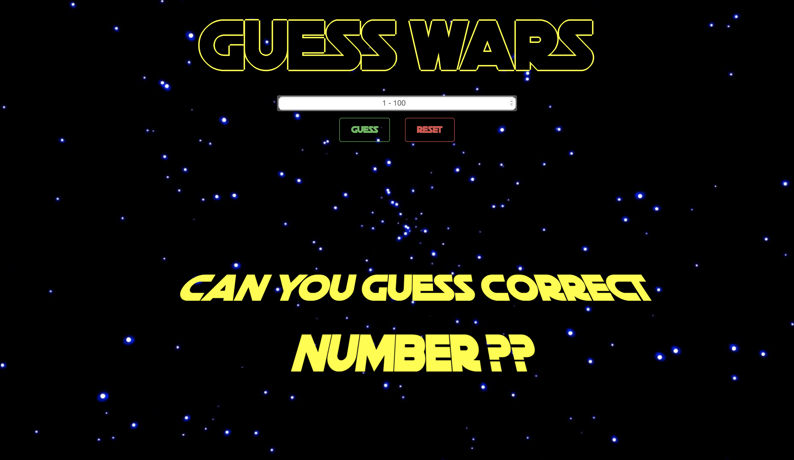
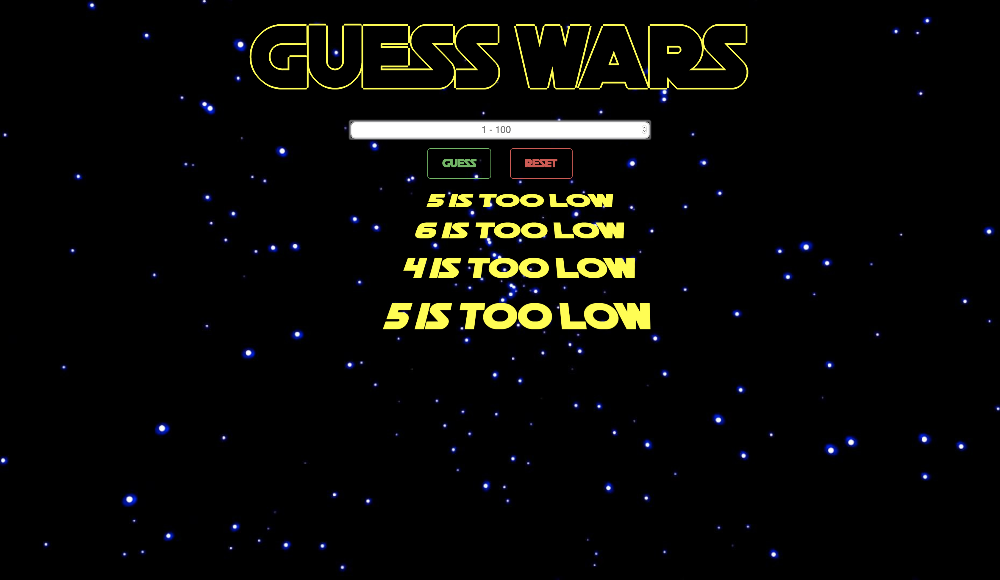

# Guess Wars

## React.js, Bootstrap, and CSS3

### Description 

Guess Wars is a Star Wars themed number guessing game built in React and utilizes CSS animation. As the game begins, the large scaled title animates into position and the the intro text begins to scroll. As the player inputs their guess, a scrolling text will notify the player whether their guess is too high, too low, or correct.

